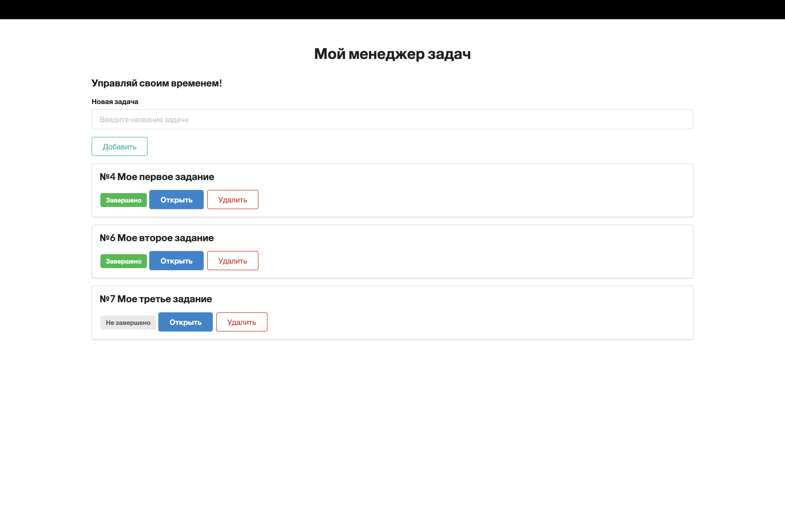

# Todo-Django

Простой ToDo менеджер, реализованный на веб-фреймворке Django
В качестве веб-интерфейса использован фреймворк Semantic UI https://semantic-ui.com/



## Установка:

Устанавливаем и активируем виртуальное окружение

```
python3 -m venv venv
source venv/bin/activate
```

Устанавливаем зависимости

```
pip install -r requirements.txt
```

Запускаем сервер

```
python manage.py runserver
```
